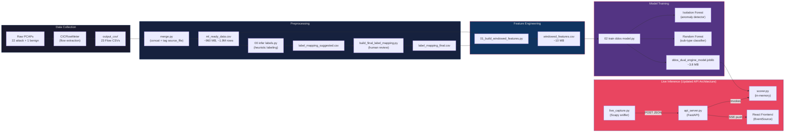
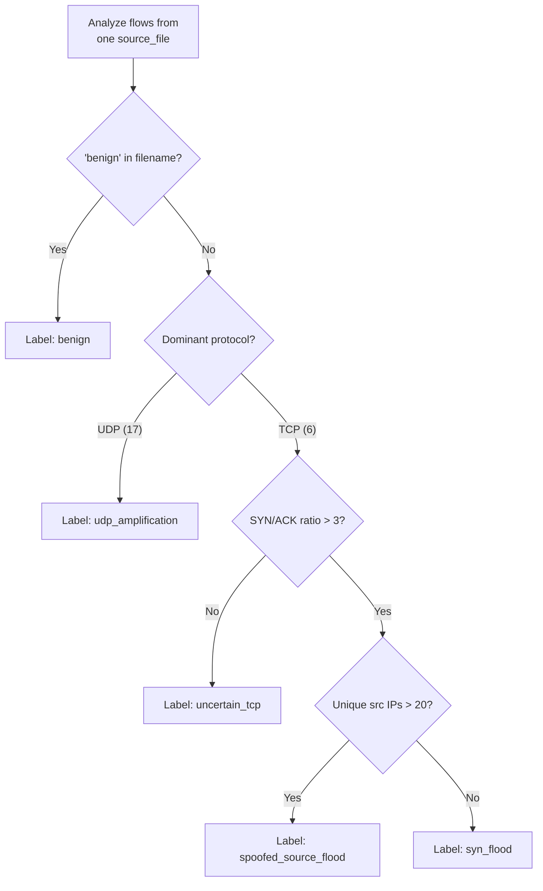

# DDoS Detection Using Dual-Engine Machine Learning — Project Documentation

> **Author:** Cybersecurity ML Pipeline Project
> **Date:** September 2026
> **Domain:** Network Security · Machine Learning · Explainable AI

---

## Table of Contents

1. [Project Overview](#1-project-overview)
2. [Problem Statement & Motivation](#2-problem-statement--motivation)
3. [System Architecture](#3-system-architecture)
4. [Dataset Description](#4-dataset-description)
5. [Pipeline Stages — End-to-End Walkthrough](#5-pipeline-stages--end-to-end-walkthrough)
   - [Stage 0: Raw Packet Capture (PCAPs)](#stage-0-raw-packet-capture-pcaps)
   - [Stage 1: Flow Extraction with CICFlowMeter](#stage-1-flow-extraction-with-cicflowmeter)
   - [Stage 2: Merge All Flow CSVs](#stage-2-merge-all-flow-csvs)
   - [Stage 3: Automated Label Inference](#stage-3-automated-label-inference)
   - [Stage 4: Final Label Mapping (Human-in-the-Loop)](#stage-4-final-label-mapping-human-in-the-loop)
   - [Stage 5: Windowed Feature Engineering](#stage-5-windowed-feature-engineering)
   - [Stage 6: Model Training (Dual-Engine)](#stage-6-model-training-dual-engine)
   - [Stage 7: Inference Scorer](#stage-7-inference-scorer)
   - [Stage 8: Live Packet Capture](#stage-8-live-packet-capture)
   - [Stage 9: API-Driven Real-Time Architecture (FastAPI + React)](#stage-9-api-driven-real-time-architecture-fastapi--react)
   - [Legacy Stage 9: Real-Time Streamlit Dashboard](#legacy-stage-9-real-time-streamlit-dashboard)
6. [Feature Engineering — Deep Dive](#6-feature-engineering--deep-dive)
7. [Model Architecture — Dual-Engine Design](#7-model-architecture--dual-engine-design)
8. [Explainability (XAI)](#8-explainability-xai)
9. [Zero-Day Simulation & Testing](#9-zero-day-simulation--testing)
10. [File Inventory](#10-file-inventory)
11. [How to Reproduce](#11-how-to-reproduce)
12. [Key Design Decisions & Lessons Learned](#12-key-design-decisions--lessons-learned)
13. [Evolution: Moving from Streamlit to a Decoupled API](#13-evolution-moving-from-streamlit-to-a-decoupled-api)

---

## 1. Project Overview

This project implements a **complete, end-to-end machine learning pipeline** for detecting Distributed Denial-of-Service (DDoS) attacks on live network traffic. It goes far beyond a simple classifier — it is a **dual-engine detection system** that combines:

| Engine | Model | Purpose |
|---|---|---|
| **Stage 1 — Anomaly Detector** | Isolation Forest | Detects *unknown / zero-day* attack patterns that the classifier has never seen |
| **Stage 2 — Sub-Type Classifier** | Random Forest (200 trees) | Classifies *known* attack types (SYN flood classic, SYN flood high-volume) with calibrated probability |

Both engines feed into an **ensemble decision function** that produces a structured alert with a severity level (`critical`, `high`, `medium`) and **human-readable explanations** via TreeSHAP and z-score analysis.

The pipeline starts from raw `.pcap` packet captures and ends at a **live React-based SOC dashboard** fed by a robust **FastAPI backend** that monitors network traffic in real time.

---

## 2. Problem Statement & Motivation

### The Threat

DDoS attacks remain one of the most prevalent and damaging cyberattacks. They overwhelm a target server with massive volumes of traffic, making legitimate services unavailable. Modern DDoS attacks come in many variants:

- **SYN Floods** — Exploit the TCP three-way handshake by sending millions of SYN packets without completing the connection, exhausting the server's connection table.
- **UDP Amplification** — Abuse open DNS/NTP/SSDP servers to reflect and amplify traffic toward the victim.
- **Low-and-Slow** — Deliberately stay under volumetric thresholds to evade traditional rate-based detection.
- **Zero-Day Variants** — Novel attack patterns that signature-based IDS/IPS systems have never seen.

### Why ML?

Traditional detection relies on **static thresholds** (e.g., "alert if > 10,000 SYN packets/second") or **signature matching** (e.g., Snort/Suricata rules). These approaches fail against:

1. **Adaptive attackers** who tune their traffic to stay just below thresholds.
2. **Zero-day attacks** that have no known signature.
3. **Legitimate traffic bursts** (flash crowds, viral content) that trigger false positives.

A machine learning approach learns the *statistical fingerprint* of normal vs. malicious traffic, adapting to the specific network it protects.

### Why a Dual-Engine?

A single classifier (Random Forest alone) can only detect attack types it was trained on. If a completely new attack vector appears, the classifier confidently labels it as whichever known class it superficially resembles — a dangerous **false negative**.

The **Isolation Forest anomaly detector** solves this by learning what *normal* traffic looks like and flagging anything that deviates significantly — even if it's a type of attack the system has never seen. The two engines complement each other:

```
                    Classifier says "attack"?
                   ┌─── YES ───┐     ┌─── NO ───┐
Anomaly detector   │           │     │           │
says "anomaly"?    │           │     │           │
       YES ──────► │ CRITICAL  │     │  MEDIUM   │  (zero-day discovered)
       NO  ──────► │   HIGH    │     │  BENIGN   │  (no alert)
                   └───────────┘     └───────────┘
```

---

## 3. System Architecture



---

## 4. Dataset Description

### 4.1 Source

The dataset was generated in a **controlled lab environment** using real DDoS attack tools targeting a victim machine. Network traffic was captured as `.pcap` files using a packet sniffer (likely Wireshark/tcpdump).

### 4.2 PCAP Files

| Category | Files | Approx. Size Each | Description |
|---|---|---|---|
| **Attack — High-Volume SYN Flood** | `0.pcap` through `18.pcap` (11 files: 0, 1, 10–18) | ~35 MB | Aggressive SYN flood with high packet rates and partially completed handshakes |
| **Attack — Classic SYN Flood** | `2.pcap` through `9.pcap`, `19.pcap`–`21.pcap` (11 files) | ~35 MB | Pure SYN flood with almost zero ACK responses (SYN/ACK ratios of 350–149,000) |
| **Benign** | `benign.pcap` | ~179 MB | Normal browsing/application traffic with diverse destination IPs |

**Total:** 23 PCAP files, approximately **800 MB** of raw packet data.

### 4.3 Flow Extraction

Each PCAP was processed through **CICFlowMeter**, an open-source tool from the Canadian Institute for Cybersecurity, which converts raw packets into **network flow records**. A flow is a bidirectional communication session between two endpoints (defined by the 5-tuple: src IP, dst IP, src port, dst port, protocol). CICFlowMeter extracts ~80 statistical features per flow (packet counts, byte counts, inter-arrival times, flag counts, etc.).

### 4.4 Merged Dataset

After merging all 23 flow CSVs, the result is `ml_ready_data.csv`:

| Property | Value |
|---|---|
| Total rows | ~1,900,000 flows |
| File size | ~960 MB |
| Source files | 23 (tagged via `source_file` column) |
| Key columns used | `Src IP`, `Dst IP`, `Timestamp`, `Protocol`, `Total Fwd Packet`, `Total Bwd packets`, `SYN Flag Count`, `ACK Flag Count`, `Packet Length Mean` |

### 4.5 Label Distribution (per suggested inference)

| Label | Source Files | Row Count (approx.) | Characteristics |
|---|---|---|---|
| `syn_flood_classic` | 2–9, 19–21 | ~318,000 | SYN/ACK ratio > 350, nearly zero ACK responses |
| `syn_flood_high_volume` | 0–1, 10–18 | ~1,587,000 | SYN/ACK ratio 2.2–2.8, partially completed handshakes |
| `benign` | benign.pcap | ~3,000 | Diverse dst IPs (305 unique), normal TCP patterns |

> [!IMPORTANT]
> The benign class is **heavily under-represented** (~0.16% of total rows). The windowing strategy and `class_weight="balanced"` in the Random Forest are critical to handle this imbalance.

---

## 5. Pipeline Stages — End-to-End Walkthrough

### Stage 0: Raw Packet Capture (PCAPs)

**Input:** Live network traffic during controlled DDoS experiments
**Output:** 23 `.pcap` files in `pcap_training_inputs/`

The experiments were conducted with a victim machine at a known IP address. Attack traffic was generated using DDoS tools (likely `hping3`, `LOIC`, or similar), while benign traffic was captured separately during normal browsing activity.

---

### Stage 1: Flow Extraction with CICFlowMeter

**Tool:** CICFlowMeter (Canadian Institute for Cybersecurity)
**Input:** 23 `.pcap` files
**Output:** 23 `*_Flow.csv` files in `output_csv/`

CICFlowMeter converts raw packets into bidirectional flow records. Each row represents one complete network flow with ~80 extracted features including:

- **Volume metrics:** Total forward/backward packets and bytes
- **Timing metrics:** Flow duration, inter-arrival times (mean, std, max, min)
- **Flag counts:** SYN, ACK, FIN, RST, PSH, URG flags
- **Packet size statistics:** Mean, std, max, min of packet lengths
- **Protocol:** IANA protocol number (6 = TCP, 17 = UDP)

> [!NOTE]
> CICFlowMeter is known to add random whitespace to column headers (e.g., `" Dst IP"` instead of `"Dst IP"`). Every script in this pipeline strips column names with `.str.strip()` to prevent `KeyError` bugs.

---

### Stage 2: Merge All Flow CSVs

**Script:** `merge.py`
**Input:** 23 CSV files from `output_csv/`
**Output:** `ml_ready_data.csv` (~960 MB)

```python
# The critical addition: tag every row with its source file
df["source_file"] = os.path.basename(f)
```

This script performs three critical operations:

1. **Reads all CSVs** from `output_csv/` using `glob.glob`.
2. **Strips whitespace** from column headers (CICFlowMeter bug workaround).
3. **Tags every row** with a `source_file` column containing the original filename. This is essential because the original pcap-to-attack-type mapping was lost — the source file name is the only reliable way to trace each flow back to its experimental context.

---

### Stage 3: Automated Label Inference

**Script:** `00 infer labels.py`
**Input:** `ml_ready_data.csv`
**Output:** `label_mapping_suggested.csv`

Since the original pcap-to-attack-type mapping was lost, this script **reverse-engineers** a label for each source file by analyzing traffic characteristics:

#### Heuristic Decision Tree



#### Key Metrics Computed Per Source File

| Metric | Formula | Purpose |
|---|---|---|
| `protocol_mode` | Most frequent protocol number | Distinguish TCP vs UDP attacks |
| `syn_ack_ratio` | `SYN_count / (ACK_count + 1)` | SYN floods have extremely high ratios (>350) |
| `unique_src_ips` | Count of distinct source IPs | Spoofed floods use many fake source IPs |
| `unique_dst_ips` | Count of distinct destination IPs | Attacks target a single IP; benign traffic is diverse |

#### Results

The heuristic correctly identified:
- **11 files as `syn_flood`** (files 2–9, 19–21) — SYN/ACK ratios of 350 to 149,244
- **11 files as `uncertain_tcp`** (files 0–1, 10–18) — SYN/ACK ratios of 2.2–2.8 (below the >3 threshold)
- **1 file as `benign`** — matched by filename

> [!NOTE]
> The `uncertain_tcp` files turned out to be high-volume SYN floods with partially completed handshakes (the ACK responses brought the ratio below 3). This was resolved in the manual review step.

---

### Stage 4: Final Label Mapping (Human-in-the-Loop)

**Script:** `build_final_label_mapping.py`
**Input:** Human review of `label_mapping_suggested.csv`
**Output:** `label_mapping_final.csv`

After reviewing the automated suggestions, the `uncertain_tcp` files were manually relabeled as `syn_flood_high_volume`, resulting in the final three-class taxonomy:

| Label | Source Files | Distinguishing Characteristics |
|---|---|---|
| `benign` | `benign.pcap_Flow.csv` | Normal traffic, diverse destinations |
| `syn_flood_classic` | 2–9, 19–21 (11 files) | Pure SYN flood, near-zero ACKs |
| `syn_flood_high_volume` | 0–1, 10–18 (11 files) | Aggressive flood with partial handshake completion |

This human-in-the-loop step is a deliberate design choice: automated heuristics provide a starting point, but a domain expert validates and corrects the labels before they become ground truth.

---

### Stage 5: Windowed Feature Engineering

**Script:** `01_build_windowed_features.py`
**Input:** `ml_ready_data.csv` + `label_mapping_final.csv`
**Output:** `windowed_features.csv` (~10 MB)

This is the most critical preprocessing step. Instead of training on individual flows (which are too granular and noisy), the pipeline aggregates flows into **fixed-size windows** of 30 consecutive rows.

#### Why Windowing?

Individual network flows are poor units of analysis for DDoS detection:
- A single SYN packet is indistinguishable from a legitimate connection attempt.
- DDoS attacks are defined by their **aggregate behavior** over time — rate, diversity, flag patterns.
- Windowing creates a richer feature space that captures temporal patterns.

#### Windowing Strategy

```
Raw flows (sorted by timestamp):
┌─────┬─────┬─────┬─────┬─────┬─────┬─────┬─────┬─────┬─────┬───
│ f1  │ f2  │ f3  │ ... │ f30 │ f31 │ f32 │ ... │ f60 │ f61 │ ...
└─────┴─────┴─────┴─────┴─────┴─────┴─────┴─────┴─────┴─────┴───
├────── Window 1 ──────┤├────── Window 2 ──────┤├── Window 3 ...
         30 rows                 30 rows
```

#### Grouping: `(source_file, Dst_IP)`

> [!IMPORTANT]
> **Critical design decision:** Windows are grouped by **both `source_file` AND `Dst IP`**, not just by source file. This is essential for the benign class, which legitimately communicates with **305 unique destination IPs**. If grouped only by source file, all benign flows would collapse into windows dominated by the most frequent destination, destroying the traffic diversity that distinguishes benign from attack. Attack files are ~99% one destination, so this change doesn't affect them.

#### Partial Window Handling

- `MIN_PARTIAL_CHUNK_FRACTION = 0.2` — the last partial window in each group is kept only if it has at least 20% of the full window size (≥ 6 rows). This prevents tiny tail chunks from creating noisy, unrepresentative windows.

#### Uniform Window Size

> [!WARNING]
> A single uniform `ROWS_PER_WINDOW = 30` is used for **all classes**. Using different chunk sizes per class would make `Total_Flows` trivially predictive of the label by construction — that's **label leakage**, not real signal.

---

### Stage 6: Model Training (Dual-Engine)

**Script:** `02 train ddos model.py`
**Input:** `windowed_features.csv`
**Output:** `ddos_dual_engine_model.joblib` (~3.8 MB)

This script performs the full training pipeline: cleaning, EDA, feature selection, temporal splitting, dual-model training, evaluation, and model serialization.

#### 6.1 Data Cleaning

```python
df = df.replace([np.inf, -np.inf], np.nan)
df[FEATURE_COLUMNS] = df[FEATURE_COLUMNS].fillna(0)
df = df.drop_duplicates()
```

- Replaces `inf` values (from division by zero in flow calculations) with `NaN`, then fills with 0.
- Removes duplicate windows.

#### 6.2 Feature Selection

**10 engineered features** are used:

| # | Feature | Type | Description |
|---|---|---|---|
| 1 | `flow_rate` | Rate | Flows per second in the window |
| 2 | `packet_rate` | Rate | Total packets (fwd + bwd) per second |
| 3 | `fwd_bwd_ratio` | Ratio | Forward-to-backward packet ratio |
| 4 | `unique_src_count` | Diversity | Number of distinct source IPs |
| 5 | `src_ip_entropy` | Diversity | Shannon entropy of source IP distribution |
| 6 | `syn_flag_sum` | Flag | Total SYN flags in the window |
| 7 | `ack_flag_sum` | Flag | Total ACK flags in the window |
| 8 | `syn_ack_ratio` | Flag Ratio | SYN/ACK imbalance (key SYN flood indicator) |
| 9 | `avg_packet_size` | Size | Mean packet length across the window |
| 10 | `packet_size_std` | Size | Standard deviation of packet lengths |

#### 6.3 Correlation-Based Feature Pruning

Features with Pearson correlation > 0.95 are automatically dropped to reduce multicollinearity. The second feature in each highly-correlated pair is removed.

#### 6.4 Temporal Train/Test Split

```python
# 70% train / 30% test, split TEMPORALLY within each class
for label, group in df.groupby("Label"):
    group = group.sort_values("Window_Start")
    cutoff = int(len(group) * 0.7)
    train_parts.append(group.iloc[:cutoff])
    test_parts.append(group.iloc[cutoff:])
```

> [!IMPORTANT]
> The split is **temporal, not random**. Within each class, the first 70% of windows (by time) go to training, and the last 30% go to testing. This prevents **temporal leakage** — if you randomly shuffle, the model can memorize time-adjacent patterns instead of learning generalizable features.

#### 6.5 Feature Scaling

**RobustScaler** is used instead of StandardScaler because DDoS traffic features often contain extreme outliers (e.g., packet rates of 50,000/sec during an attack vs. 5/sec normally). RobustScaler uses the median and interquartile range (IQR), making it resistant to these outliers.

#### 6.6 Stage 1 — Isolation Forest (Anomaly Detector)

```python
iso_model = IsolationForest(contamination=0.05, random_state=42)
iso_model.fit(X_train[benign_mask_train])  # Trained ONLY on benign traffic
```

Key design points:

- **Trained exclusively on benign traffic** — it learns the "shape" of normal network behavior.
- **`contamination=0.05`** — allows up to 5% of training data to be considered anomalous (accounts for noise in the benign capture).
- **Anomaly scores are normalized** to [0, 1] using min-max scaling against the benign training scores.
- **Threshold: `ANOMALY_SCORE_THRESHOLD = 0.7`** — anything above this is flagged as anomalous.

#### 6.7 Stage 2 — Random Forest (Sub-Type Classifier)

```python
clf = RandomForestClassifier(
    n_estimators=200,
    class_weight="balanced",
    random_state=42
)
clf.fit(X_train, y_train)
```

Key design points:

- **200 decision trees** — provides strong ensemble diversity without excessive computation.
- **`class_weight="balanced"`** — automatically upweights the minority benign class to counter the severe class imbalance (~0.16% benign vs ~84% high-volume flood).
- **Threshold: `CLASSIFIER_CONFIDENCE_THRESHOLD = 0.5`** — the classifier must be >50% confident in a non-benign prediction to fire.

#### 6.8 Ensemble Decision Function

The two engines combine via a **severity matrix**:

| Condition | Threat Class | Severity | Evidence Source |
|---|---|---|---|
| Classifier fires **AND** Anomaly fires | Predicted attack type | **Critical** | TreeSHAP top-3 features |
| Classifier fires, Anomaly silent | Predicted attack type | **High** | TreeSHAP top-3 features |
| Classifier silent, Anomaly fires | `ddos_unknown_variant` | **Medium** | Z-score top-3 features |
| Neither fires | — | **No alert** | — |

The `medium` severity case is the **zero-day detection pathway**: the classifier doesn't recognize it as a known attack, but the anomaly detector flags it as abnormal.

#### 6.9 Model Serialization

The trained model is saved as a single `.joblib` bundle containing:

```python
bundle = {
    "iso_model": iso_model,           # Isolation Forest
    "clf": clf,                        # Random Forest
    "scaler": scaler,                  # RobustScaler (fitted)
    "feature_cols": feature_cols,      # After correlation pruning
    "score_min": score_min,            # For anomaly score normalization
    "score_max": score_max,
    "benign_mean": benign_mean,        # For z-score explainability
    "benign_std": benign_std,
}
```

---

### Stage 7: Inference Scorer

**Script:** `backend/scorer.py`

This is the **production inference module** that loads the saved model bundle and exposes a single function:

```python
def score_window(feature_dict: dict) -> dict:
```

**Input:** A dictionary of feature values for one window.
**Output:** A structured alert dictionary:

```python
# If attack detected:
{
    "is_alert": True,
    "threat_class": "syn_flood_classic",
    "confidence_score": 0.943,
    "severity": "critical",
    "supporting_evidence": {
        "syn_ack_ratio": 0.3821,       # SHAP contribution
        "flow_rate": 0.1544,
        "packet_rate": 0.0892
    },
    "anomaly_score": 0.872,
    "classifier_probability": 0.943
}

# If benign:
{
    "is_alert": False,
    "anomaly_score": 0.123,
    "classifier_probability": 0.021
}
```

The scorer pre-computes the SHAP `TreeExplainer` on load for fast per-window inference.

> [!NOTE]
> The scorer's anomaly threshold is set to `0.40` (lower than training's `0.70`), making the production system **more sensitive** to anomalies than the training validation.

---

### Stage 8: Live Packet Capture

**Script:** `backend/live_capture.py`

This script uses **Scapy** to sniff live network traffic in 5-second windows and extract the same features the model expects. 

*Updated Behavior:* Instead of writing to a local CSV file, the script now sends the extracted feature window directly to the FastAPI backend via a `POST /api/score` request.

```python
VICTIM_IP = "192.168.1.50"
API_ENDPOINT = "http://localhost:8000/api/score"

while True:
    packets = sniff(timeout=5, filter=f"ip dst {VICTIM_IP} or ip src {VICTIM_IP}")
    # ... extract features ...
    requests.post(API_ENDPOINT, json=feature_dict)
```

#### Feature Extraction from Raw Packets

| Feature | Extraction Method |
|---|---|
| `flow_rate` | `total_packets / 5.0` |
| `packet_rate` | `total_packets / 5.0` |
| `fwd_bwd_ratio` | `inbound_packets / (outbound_packets + 1)` |
| `unique_src_count` | Count of distinct source IPs targeting the victim |
| `syn_flag_sum` | Count of packets with TCP SYN flag set |
| `ack_flag_sum` | Count of packets with TCP ACK flag set |
| `syn_ack_ratio` | `syn_flags / (ack_flags + 1)` |
| `avg_packet_size` | Mean of all packet lengths |
| `packet_size_std` | Std deviation of packet lengths |

---

### Stage 9: API-Driven Real-Time Architecture (FastAPI + React)

**Backend:** `backend/api_server.py`
**Frontend Hook:** `frontend/client/src/hooks/useSSEStream.ts`

The legacy disk-polling dashboard has been completely replaced by a **zero-disk-I/O, decoupled Client-Server architecture**.

#### The FastAPI Backend
An in-memory FastAPI server (`api_server.py`) now acts as the central hub:
1. It exposes `POST /api/score` to receive feature windows from the Scapy sniffer.
2. It loads `scorer.py` in-memory to evaluate the window instantly.
3. It exposes `GET /api/stream`, maintaining persistent Server-Sent Events (SSE) connections to multiple frontend clients.

#### The React Frontend
The UI is a dedicated React/Vite application. It uses a custom hook (`useSSEStream.ts`) to maintain a robust SSE connection with the backend.

#### Data Flow
```
live_capture.py ──POST JSON──► api_server.py ──SSE push──► React Frontend
   (Scapy)                       (FastAPI)                  (EventSource)
                                     │
                                     ▼
                                 scorer.py
                             (in-memory inference)
```

### Legacy Stage 9: Real-Time Streamlit Dashboard
*(Preserved for historical context)*
**Script:** `dashboard.py`

The original dashboard provided a real-time monitoring interface reading from `live_stream.csv`. It polled the CSV file every second for new rows.

---

## 6. Feature Engineering — Deep Dive

The 10 features were designed to capture the **behavioral fingerprint** of DDoS attacks across four dimensions:

### Rate Features

| Feature | Formula | Why It Matters |
|---|---|---|
| `flow_rate` | `n_flows / elapsed_seconds` | DDoS attacks generate orders of magnitude more flows per second than normal traffic |
| `packet_rate` | `(fwd_pkts + bwd_pkts) / elapsed_seconds` | Captures volumetric intensity even when flow counts are similar |

### Ratio Features

| Feature | Formula | Why It Matters |
|---|---|---|
| `fwd_bwd_ratio` | `fwd_packets / (bwd_packets + 1)` | DDoS traffic is highly asymmetric (attacker sends, victim rarely responds). Benign traffic is roughly balanced |

### Diversity Features

| Feature | Formula | Why It Matters |
|---|---|---|
| `unique_src_count` | Count of distinct src IPs | Spoofed floods use thousands of fake source IPs; benign traffic comes from few sources per destination |
| `src_ip_entropy` | Shannon entropy: $H = -\sum p_i \log_2 p_i$ | Measures the *uniformity* of source IP distribution. Spoofed IPs are uniformly distributed (high entropy); legitimate traffic is concentrated (low entropy) |

### TCP Flag Features

| Feature | Formula | Why It Matters |
|---|---|---|
| `syn_flag_sum` | Sum of SYN flags | Raw volume of connection initiation attempts |
| `ack_flag_sum` | Sum of ACK flags | Healthy connections complete the handshake (SYN → SYN-ACK → ACK). Floods don't |
| `syn_ack_ratio` | `syn_sum / (ack_sum + 1)` | **The single most discriminative feature for SYN floods.** Classic floods have ratios > 350; benign traffic is ~1.0 |

### Packet Size Features

| Feature | Formula | Why It Matters |
|---|---|---|
| `avg_packet_size` | Mean of `Packet Length Mean` across flows | SYN-only packets are tiny (~40–60 bytes); normal web traffic includes larger data payloads |
| `packet_size_std` | Std of `Packet Length Mean` | Low variance indicates homogeneous attack traffic; high variance indicates diverse legitimate usage |

---

## 7. Model Architecture — Dual-Engine Design

### Isolation Forest (Stage 1)

The Isolation Forest works by randomly selecting a feature and a split value, then counting how many splits are needed to *isolate* a data point. Anomalies are easier to isolate (fewer splits needed) because they exist in sparse regions of feature space.

**Training data:** Only benign windows. The model learns the "normal envelope" of network behavior.

**Scoring:** The raw Isolation Forest score is negated and normalized to [0, 1]:

```python
anomaly_score = (raw_score - score_min) / (score_max - score_min + 1e-9)
```

Where `score_min` and `score_max` are derived from the benign training set. A score of 1.0 means maximally anomalous relative to the training distribution.

### Random Forest (Stage 2)

A 200-tree ensemble classifier trained on all three classes. Each tree is a full decision tree trained on a bootstrapped sample with random feature subsets, and the final prediction is the majority vote.

**Class weighting:** `balanced` mode automatically sets class weights inversely proportional to class frequencies:

```
weight_i = n_samples / (n_classes × n_samples_i)
```

This effectively upsamples the minority benign class and downsamples the majority attack classes during training.

### Why These Models?

| Property | Isolation Forest | Random Forest |
|---|---|---|
| **Type** | Unsupervised anomaly detector | Supervised multi-class classifier |
| **Strength** | Detects unknown patterns | Precise sub-type classification |
| **Weakness** | Cannot name the attack type | Blind to novel attack types |
| **Training data** | Benign only | All classes |
| **Output** | Anomaly score [0, 1] | Class probabilities |

---

## 8. Explainability (XAI)

Every alert includes **human-readable evidence** explaining *why* the system flagged the traffic. Two complementary XAI methods are used:

### TreeSHAP (for classifier alerts)

When the Random Forest fires, **TreeSHAP** (an exact, polynomial-time SHAP algorithm for tree-based models) computes each feature's contribution to the predicted class.

```python
explainer = shap.TreeExplainer(clf)
shap_values = explainer.shap_values(x_scaled)
```

The top-3 features by absolute SHAP value are returned as evidence:

```python
{"syn_ack_ratio": 0.3821, "flow_rate": 0.1544, "packet_rate": 0.0892}
```

**Interpretation:** "The model classified this as a SYN flood primarily because the SYN/ACK ratio was extremely abnormal (SHAP contribution: +0.38), and the flow rate was unusually high (+0.15)."

### Z-Score Analysis (for anomaly-only alerts)

When only the Isolation Forest fires (zero-day pathway), SHAP values aren't available (unsupervised model). Instead, **z-scores** against the benign training distribution are computed:

```python
z = abs((feature_value - benign_mean) / benign_std)
```

The top-3 features by z-score are returned:

```python
{"unique_src_count": 48.32, "src_ip_entropy": 12.7, "avg_packet_size": 8.91}
```

**Interpretation:** "This traffic is anomalous because the number of unique source IPs is 48 standard deviations above the benign average, which is extremely unusual."

---

## 9. Zero-Day Simulation & Testing

**Script:** `inject_zeroday.py`

To validate the anomaly detection pathway, **4 synthetic zero-day attack vectors** were injected into `windowed_features.csv`. These vectors are designed to be fundamentally different from both SYN flood variants:

| Vector | Attack Type | Key Anomaly | Why It's Novel |
|---|---|---|---|
| **1** | Distributed low-rate port sweep | `unique_src_count = 480` | Low volume (2.4 flows/sec) with massive IP spread — evades volumetric detection |
| **2** | Coordinated micro-probe | `unique_src_count = 620` | Severe botnet dispersion with balanced handshakes (SYN/ACK ≈ 1.0) |
| **3** | Jumbo buffer overflow probe | `avg_packet_size = 1492` | Normal rate but extreme packet sizes — targets application-layer vulnerabilities |
| **4** | Asymmetric handshake anomaly | `unique_src_count = 2500`, `src_ip_entropy = 9.5` | Extreme IP diversity + no ACK responses, but very low volume |

These vectors should trigger the Isolation Forest (they deviate massively from benign baselines) but **not** the Random Forest (they don't match any trained SYN flood pattern), resulting in `medium` severity "zero-day anomaly" alerts.

---

## 10. File Inventory

### Core Pipeline (Run in Order)

| Step | File | Purpose |
|---|---|---|
| Pre-req | `merge.py` | Concatenate all CICFlowMeter CSVs, tag with `source_file` |
| Step 0 | `00 infer labels.py` | Heuristic label inference from traffic characteristics |
| Step 0.5 | `build_final_label_mapping.py` | Encode the human-reviewed labels into `label_mapping_final.csv` |
| Step 1 | `01_build_windowed_features.py` | Fixed-size windowed feature engineering |
| Step 2 | `02 train ddos model.py` | Train dual-engine model, evaluate, save |

### Inference & Deployment

| File | Purpose |
|---|---|
| `backend/api_server.py` | In-Memory FastAPI Backend, exposes SSE `/api/stream` |
| `backend/scorer.py` | Production inference module — loads model, exposes `score_window()` |
| `backend/live_capture.py` | Real-time Scapy packet sniffer, posts to `/api/score` |
| `frontend/` | React/Vite frontend SOC Dashboard |

### Utilities & Diagnostics

| File | Purpose |
|---|---|
| `inject_zeroday.py` | Inject synthetic zero-day anomaly vectors for testing |
| `run_windowing.py` | Early prototype windowing script (superseded by `01_build_windowed_features.py`) |
| `label.py` | Early prototype threshold-based labeling (superseded) |
| `diag.py` | Diagnostic script to inspect time spans and destination IP diversity |

### Data Files

| File | Size | Description |
|---|---|---|
| `pcap_training_inputs/*.pcap` | ~800 MB total | Raw packet captures (22 attack + 1 benign) |
| `output_csv/*_Flow.csv` | ~750 MB total | CICFlowMeter flow records |
| `ml_ready_data.csv` | ~960 MB | Merged flow dataset with source file tags |
| `label_mapping_suggested.csv` | 1.5 KB | Automated heuristic labels + statistics |
| `label_mapping_final.csv` | 876 B | Human-reviewed final labels (3 classes) |
| `windowed_features.csv` | ~10 MB | Engineered windowed features (model input) |
| `backend/ddos_dual_engine_model.joblib` | ~3.8 MB | Serialized dual-engine model bundle |

---

## 11. How to Reproduce

### Prerequisites

```
Python 3.10+
Node.js and npm (for the frontend dashboard)
CICFlowMeter (for PCAP → CSV conversion)
```

### Python Dependencies

```bash
pip install fastapi uvicorn pandas numpy scikit-learn shap joblib scapy
```

### 1. Model Training (Optional, if you have raw data)

```bash
# Step 0: Convert PCAPs to flow CSVs (external tool)
# Run CICFlowMeter on each .pcap file in pcap_training_inputs/
# Output goes to output_csv/

# Step 1: Merge all CSVs
python merge.py

# Step 2: Infer labels (optional — already done)
python "00 infer labels.py"

# Step 3: Build final label mapping (optional — already done)
python build_final_label_mapping.py

# Step 4: Engineer windowed features
python 01_build_windowed_features.py

# Step 5: Train the dual-engine model
python "02 train ddos model.py"

# Step 6 (optional): Inject zero-day test vectors
python inject_zeroday.py
```

### 2. Booting the Application

You will need two separate terminal windows.

#### Boot the Backend (FastAPI + Scapy)
Open a terminal and navigate to the `backend` folder:
```bash
cd backend
python api_server.py
```
*(This starts the API server on `http://localhost:8000`)*

In another terminal, start the live packet capture (requires admin/root for raw sockets):
```bash
cd backend
# Edit VICTIM_IP in live_capture.py first!
sudo python live_capture.py
```

#### Boot the Frontend (React + Vite)
Open a second terminal and navigate to the `frontend` folder:
```bash
cd frontend
npm install
npm run dev
```
Navigate to `http://localhost:3000` to view the live dashboard.

---

## 12. Key Design Decisions & Lessons Learned

### 1. Windowing by `(source_file, Dst_IP)` — Not Just Source File

**Problem:** When windowing only by `source_file`, benign traffic (which talks to 305 unique destinations) collapsed into windows dominated by the single most-frequent destination. This destroyed the traffic diversity that distinguishes benign from attack traffic, causing the model to undercount benign windows.

**Solution:** Group by `(source_file, Dst_IP)` before chunking. Attack files are ~99% one destination, so they're unaffected. Benign traffic now produces windows across all 305 destinations, preserving its natural diversity.

### 2. Uniform Window Size to Prevent Leakage

**Problem:** An earlier design used different window sizes for different classes. This made `Total_Flows` trivially predictive of the label — the model was learning "30-row windows are attacks, 10-row windows are benign" instead of learning actual traffic patterns.

**Solution:** A single `ROWS_PER_WINDOW = 30` for all classes. The model must distinguish attack from benign using genuinely discriminative features, not window size.

### 3. Temporal Split, Not Random

**Problem:** Random train/test splits in time-series data cause temporal leakage — the model memorizes time-specific patterns (e.g., traffic from 14:30 is always attack) instead of learning generalizable features.

**Solution:** Within each class, the first 70% of windows (chronologically) go to training, the last 30% to testing.

### 4. RobustScaler Over StandardScaler

**Problem:** DDoS features have extreme outliers (attack flow rates are 1000× normal). StandardScaler's mean/std are heavily skewed by these outliers.

**Solution:** RobustScaler uses median and IQR, which are resistant to outliers.

### 5. `class_weight="balanced"` for Imbalance

**Problem:** Benign traffic is ~0.16% of the dataset. Without weighting, the model could achieve 99.8% accuracy by predicting "attack" for everything.

**Solution:** `class_weight="balanced"` automatically upweights the benign class during training, ensuring the model pays equal attention to all classes.

### 6. Dual Explainability (SHAP + Z-Score)

**Problem:** SHAP values require a supervised model. When only the unsupervised Isolation Forest fires (zero-day pathway), SHAP isn't available.

**Solution:** Use TreeSHAP for classifier alerts, z-score deviation for anomaly-only alerts. Both provide human-readable "here's why we flagged this" evidence.

---

## 13. Evolution: Moving from Streamlit to a Decoupled API

The most significant update to this pipeline is the transition from a monolithic Streamlit application to a decoupled Client-Server architecture using FastAPI and React.

### Why We Made This Change

1. **Eliminating Disk I/O Bottlenecks:** The previous architecture relied on `live_capture.py` writing rows to `live_stream.csv`, which `dashboard.py` would then repeatedly poll. This disk-bound operation introduced latency and was inefficient at scale. The new system is entirely **in-memory**. `live_capture.py` sends a JSON POST request directly to the FastAPI server, which evaluates it instantly and streams the result.
2. **Low-Latency Streaming:** By utilizing Server-Sent Events (SSE) via the `/api/stream` endpoint, the FastAPI backend pushes verdicts to the React frontend the moment they are scored. The UI no longer needs to artificially poll every second.
3. **True Decoupling:** Separating the ML inference layer (Python/FastAPI) from the presentation layer (TypeScript/React) allows both components to scale independently. It also lets us leverage the massive React ecosystem for richer, more interactive visualizations (e.g., using robust state management and modern CSS).
4. **Multi-Client Fan-Out:** The FastAPI `SSEClientManager` manages an `asyncio.Queue` for each connected client. This means multiple analysts can open the SOC dashboard simultaneously, and a single scoring event is seamlessly broadcast to all of them without duplicating the ML workload.
5. **Robustness:** The new `useSSEStream.ts` hook incorporates exponential backoff for reconnections, late-join catch-up via a `/api/history` endpoint, and health polling.
